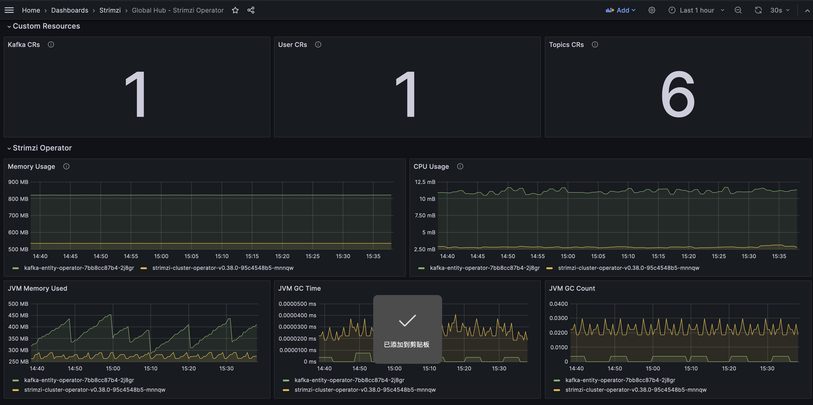
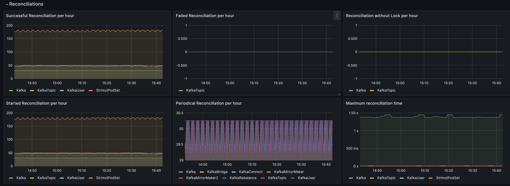
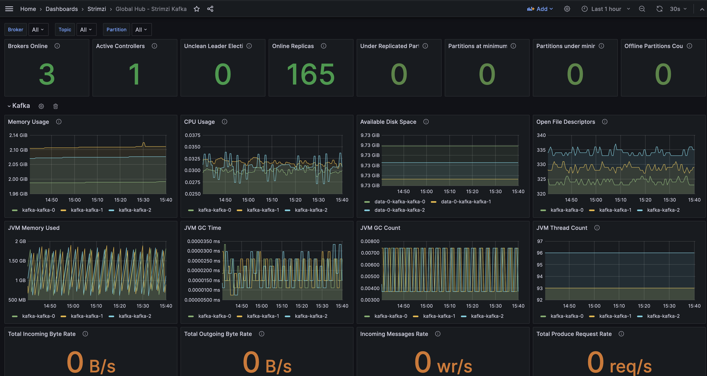
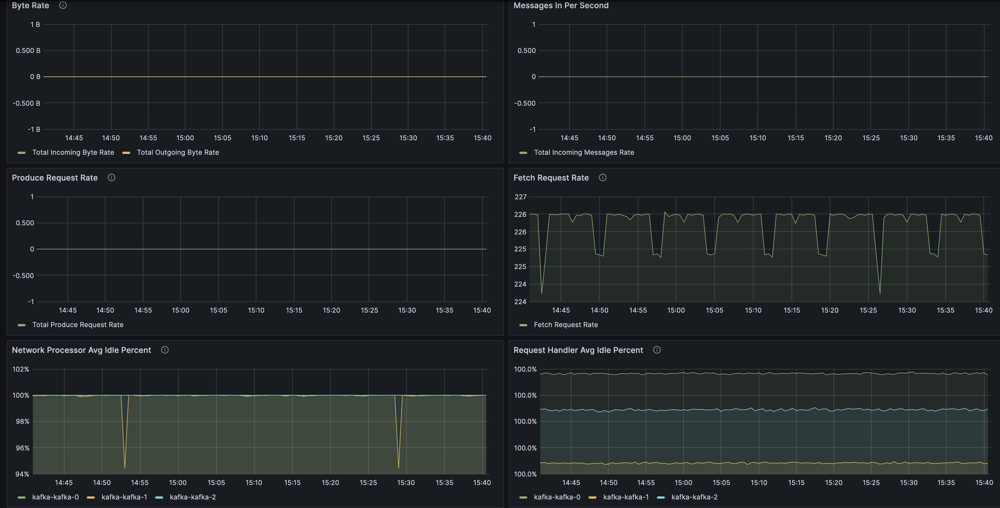
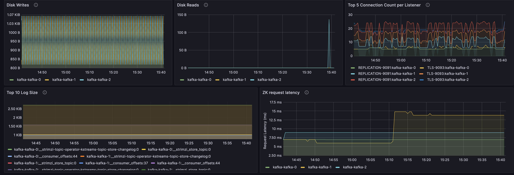
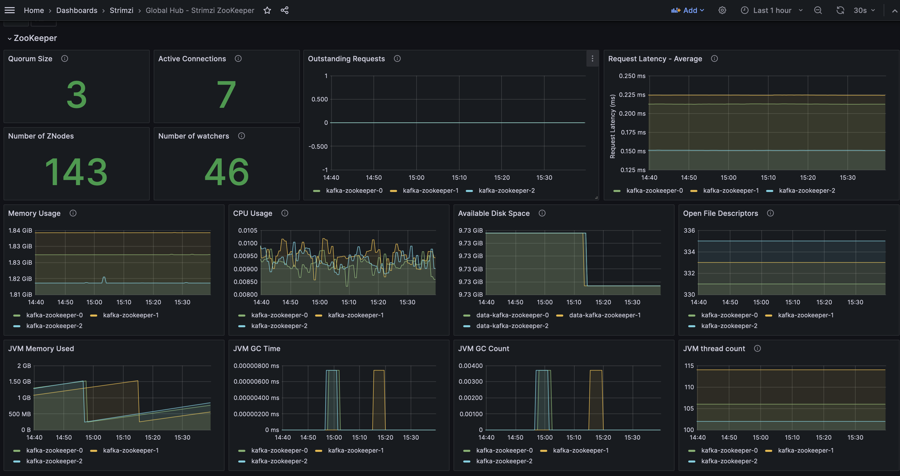
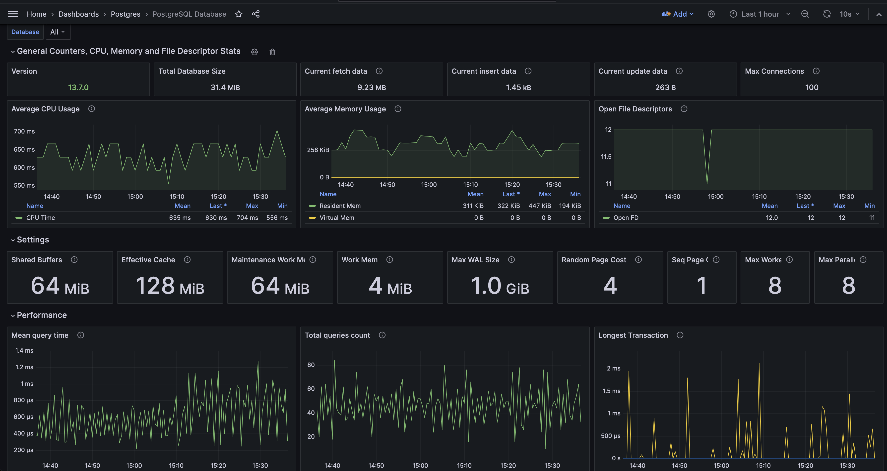
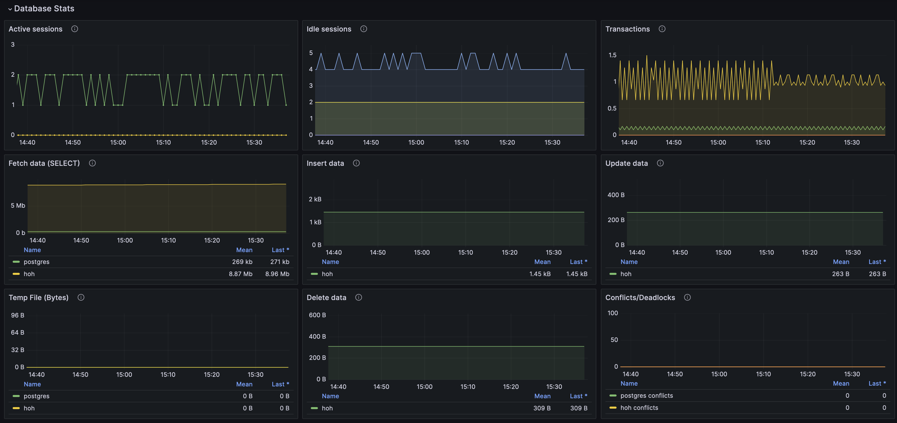

# Viewing Strimzi info by using Grafana dashboards
Collecting metrics is critical for understanding the health and performance of your Kafka deployment and postgres database. By monitoring metrics, you can actively identify issues before they become critical and make informed decisions about resource allocation and capacity planning. Without metrics, you may be left with limited visibility into the behavior of your Kafka deployment, which can make troubleshooting more difficult and time-consuming.

You can check the dashboards in global hub grafana. You will see the following dashboards under Strimzi folder:
- Global Hub - Strimzi Operator

- Global Hub - Strimzi Kafka

- Global Hub - Strimzi Zookeeper

# Viewing Postgres info by using Grafana dashboards (Technology Preview)
We also collect some the Postgres metrics and show in the grafana dashboard. It's easily to get the Postgres config and performance in the dashboard.

You could see the Postgres dashboards in Postgres folder:

- Global Hub - PostgreSQL Database

